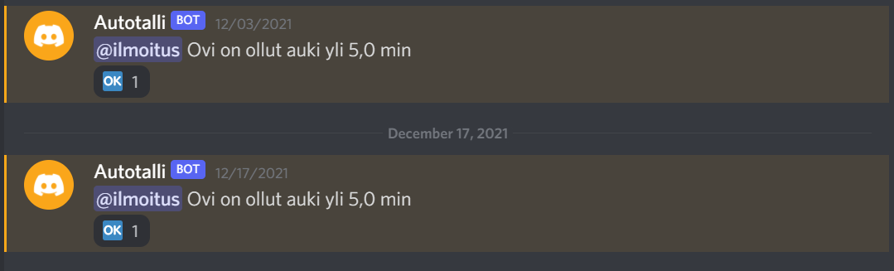

# Garage bot
Constantly checks if the garage door is opened/closed using a button that is pressed by the garage door when it is closed.
If the garage door is open for the time specified by the user, the bot notifies the user through discord and reacts "OK" when the garage door is closed\
Next step is to use hall effect sensor to improve accuracy

